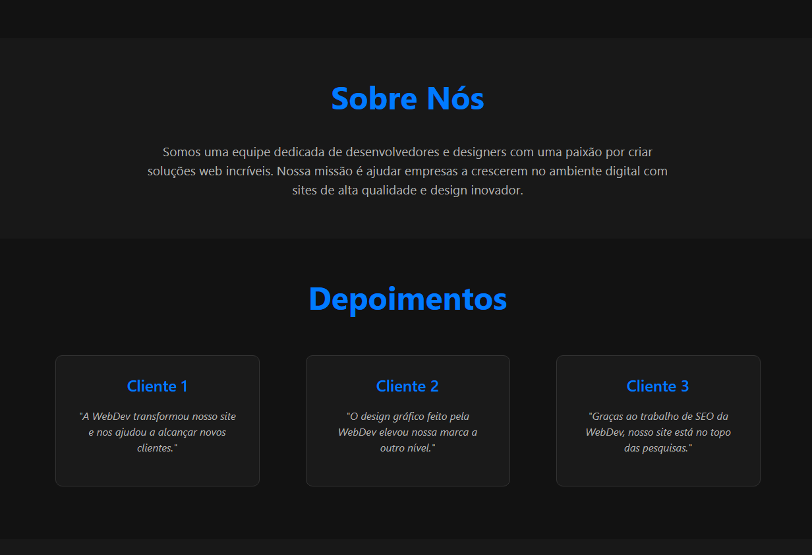

# WebDev - Transformando Ideias em Realidade Digital

É um projeto que visa transformar ideias em soluções digitais

## Conceito e Objetivo


Imagem - Hero Section

A ideia por trás desse projeto é auxiliar pessoas e empresas a concretizar suas visões digitais. Imagine que você tem uma ideia inovadora para o seu negócio, mas precisa de ajuda para transformá-la em um produto tangível, como um aplicativo, site ou sistema.

- **Processo de Transformação:**
  Assim como um escultor vê a beleza oculta em uma pedra bruta, a **WebDev** enxerga o potencial do seu produto, mesmo quando ele existe apenas como uma ideia.
  

## Serviços Oferecidos:


**- Desenvolvimento Web:** Transformamos suas ideias em sites que combinam funcionalidade, estética e aplicativos funcionais.

**- UX/UI:** Lorem

**- SEO:** Melhores tecnicas para rankeamento no Google.

## Entre em contato via Formulario


#### Se você quiser saber mais detalhes ou explorar o projeto, pode visitar o repositório no GitHub (https://github.com/tanaka-11/agencia-de-desenvolvimento)

## Futuramente

#### Banco de Dados

- Nome: **webdev**

- Tabela de Clientes

```sql
CREATE TABLE clientes (
    id INT PRIMARY KEY AUTO_INCREMENT,
    nome VARCHAR(255) NOT NULL,
    email VARCHAR(255) NOT NULL,
    mensagem TEXT
);
```

- Tabela de Serviços

```sql
CREATE TABLE servicos (
    id INT PRIMARY KEY AUTO_INCREMENT,
    titulo VARCHAR(255) NOT NULL,
    descricao TEXT NOT NULL,
    imagem VARCHAR(255) NOT NULL
);
```
